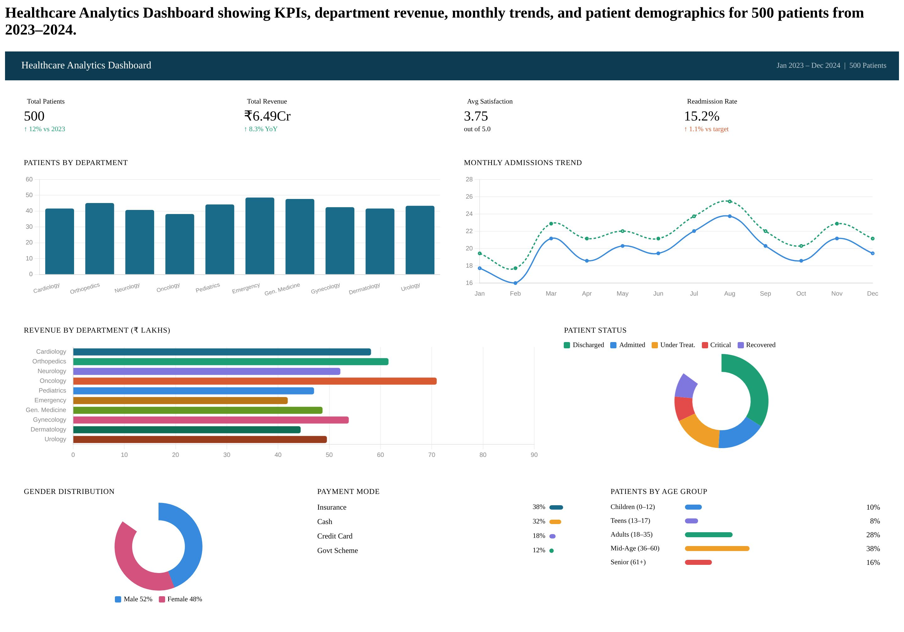

# 🏥 Healthcare Analytics Dashboard

## 📊 Overview
This Power BI dashboard analyzes hospital data for 500 patients (2023–2024).

### Key Insights:
- Total Patients
- Revenue Analysis
- Readmission Rate
- Department Performance
- Patient Demographics

## 🛠 Tools Used
- Power BI
- DAX
- Excel

## 📁 Project Files
- Healthcare_Dashboard.pbix
- Healthcare_Dashboard_Data.xlsx
- dashboard.png
- DAX_Measures.txt

## 📸 Dashboard Preview

## 👨‍💻 Author
**Shivraj Sagane**

- GitHub: https://github.com/Shivrajsagane  
- LinkedIn: https://www.linkedin.com/in/shivraj-sagane-3939a4290
